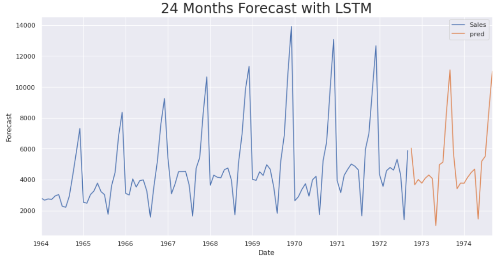

# Champagne Sales Forecasting Using SARIMA and LSTM

This project focuses on time series forecasting using the *Perrin Freres Monthly Champagne Sales* dataset from [Kaggle](https://www.kaggle.com/datasets/anupamshah/perrin-freres-monthly-champagne-sales). It demonstrates a full pipeline of time series analysis using both classical statistical modeling (SARIMA) and deep learning (LSTM) to predict future sales trends.

## Dataset

The dataset used is *Perrin Freres Monthly Champagne Sales*, which contains monthly sales data of champagne bottles. It serves as a great case study for understanding time series forecasting due to its clear seasonal pattern and trend components.

## Objective

The main objective of this project is to:
- Analyze the historical champagne sales data.
- Explore its structure, seasonality, and stationarity.
- Apply time series forecasting models to predict future sales.
- Compare the effectiveness of SARIMA and LSTM models.

## Goals

- *Data Preprocessing:* Clean the data, handle missing values, convert dates, and set the time index.
- *Exploratory Analysis:* Visualize trends and seasonal components using decomposition and other plots.
- *Model Building:* 
  - Build and tune a *SARIMA* model with seasonal order (1,1,1,12) to capture seasonality.
  - Design and train an *LSTM* network after normalizing and reshaping the data.
- *Evaluation:* Compute performance metrics such as RMSE and MAPE to compare the models.
- *Forecasting:* Generate future predictions and compare model results.

## Results

- *SARIMA Model:*
  - Captured the seasonal pattern effectively with the chosen order.
  - Achieved a low MAPE and RMSE, indicating reliable short-term forecasts.
- *LSTM Model:*
  - Successfully modeled the overall trend but was slightly less accurate on seasonal spikes.
  - RMSE was competitive but marginally higher than that of SARIMA.
- *Conclusion:*
  - For this dataset, classical SARIMA outperformed LSTM in terms of accuracy.
  - The project highlights that traditional time series methods can still be highly effective, especially with clear seasonality and limited data size.

## Forecast Visualization

Below is a preview of one of the forecasting visualizations:

## Skills Demonstrated

- *Time Series Analysis:* Decomposition, stationarity testing (ADF Test), and seasonal adjustment.
- *Data Preprocessing:* Data cleaning, handling missing values, date formatting, and indexing.
- *Visualization:* Creating time series plots and seasonal decomposition charts.
- *Statistical Modeling:* Building and tuning SARIMA models using statsmodels.
- *Deep Learning:* Designing and training LSTM networks using TensorFlow/Keras.
- *Model Evaluation:* Calculating performance metrics (RMSE, MAPE) and comparing models.
- *Problem Solving:* Iterative model improvement and effective forecasting for real-world data.

## Conclusion

This project not only demonstrates the application of both classical and deep learning forecasting techniques but also deepens the understanding of time series data behavior. By comparing SARIMA and LSTM, I gained insights into model selection and performance tuning—essential skills for data science, analytics, and machine learning roles.

Note: The dataset is publicly available on Kaggle and is used here solely for educational and demonstration purposes.
